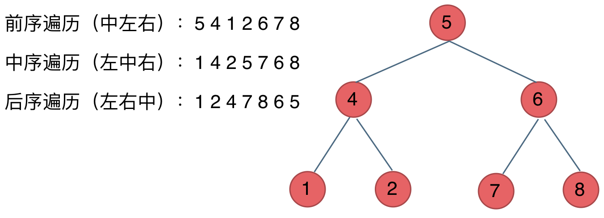

#### 二叉树
##### 序号
- 二叉树的递归遍历：PreOrderTraversal
    - [144]二叉树的前序遍历
    - [145]二叉树的后序遍历
    - [94]二叉树的中序遍历
- 二叉树的迭代遍历：TreeOrderTraversalByStack
    - [144]二叉树的前序遍历
    - [145]二叉树的后序遍历
    - [94]二叉树的中序遍历
- 二叉树的统一迭代法：https://www.programmercarl.com/%E4%BA%8C%E5%8F%89%E6%A0%91%E7%9A%84%E7%BB%9F%E4%B8%80%E8%BF%AD%E4%BB%A3%E6%B3%95.html#%E8%BF%AD%E4%BB%A3%E6%B3%95%E4%B8%AD%E5%BA%8F%E9%81%8D%E5%8E%86  
- 二叉树的层序遍历（也叫广序遍历）
    类似题目：  
    - [102]二叉树的层序遍历：LevelOrder
    - [107]二叉树的层次遍历II：LevelOrder2
    - [199]二叉树的右视图：RightSideView
    - [637]二叉树的层平均值：AverageOfLevels
    - [429]N叉树的层序遍历：MultipleNodeLevelOrder
    - [515]在每个树行中找最大值：LargestValuesInLevelOrder
    - [116]填充每个节点的下一个右侧节点指针：ConnectNode
    - [117]填充每个节点的下一个右侧节点指针II：ConnectNode2
    - [104]二叉树的最大深度：MaxDepth
    - [111]二叉树的最小深度：MinDepth
- [226]翻转二叉树：InverseBinaryTree
- [101]对称二叉树：SymmetricTree
- [104]二叉树的最大深度：MaxDepth
- [111]二叉树的最小深度：MinDepth
- [222]完全二叉树的节点个数：CountNodes
- [110]平衡二叉树：IsBalanced
- [257]二叉树的所有路径：BinaryTreePaths
- [404]左叶子之和：SumOfLeftLeaves
- [513]找树左下角的值：FindBottomLeftValue
- [112]路径总和：HasPathSum
- [106]从中序与后序遍历序列构造二叉树：BuilderTree
- [105]从前序与中序遍历序列构造二叉树：BuilderTree2
- [654]最大二叉树：ConstructMaximumBinaryTree
- [617]合并二叉树：MergeTrees
- [700]二叉搜索树中的搜索：SearchBST
- [98]验证二叉搜索树：IsValidBST
- [530]二叉搜索树的最小绝对差：GetMinimumDifference
- [501]二叉搜索树中的众数：FindMode
- [236]二叉树的最近公共祖先：没写
- [235]二叉搜索树的最近公共祖先：没写
- [701]二叉搜索树中的插入操作：InsertIntoBst
- [450]删除二叉搜索树中的节点：DeleteNode
- [669]修剪二叉搜索树：TrimBST
- [108]将有序数组转换成二叉搜索树（二叉排序树）：SortedArrayConvertToBST
- [538]把二叉搜索树转换为累加树：ConvertBST
- [114]二叉树展开为链表：Flatten
- [JZ77]按之字形顺序打印二叉树：PrintZhi
- [103]二叉树的锯齿形层序遍历：PrintZhi
- [230]二叉搜索树中第K小的元素：KthSmallest

##### 总结
二叉树的遍历  
深度优先遍历：先往深走，遇到叶子节点再往回走。  
广度优先遍历：一层一层的去遍历。
- 前序遍历：中左右
- 中序遍历：左中右
- 后序遍历：左右中  

  
我们使用递归的方式来实现深度优先遍历，也就是实现前中后序遍历，使用递归是比较方便的。
  
广度优先遍历的实现一般使用队列来实现，这也是队列先进先出的特点所决定的，因为需要先进先出的结构，才能一层一层的来遍历二叉树。  
